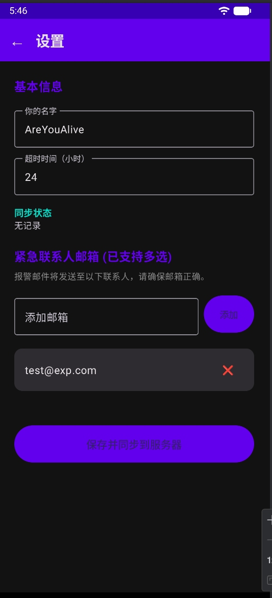
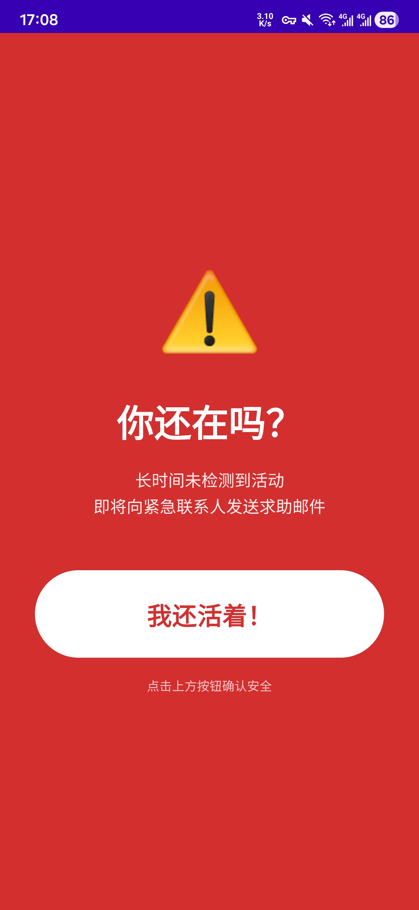

# 活着吗 (Are You Alive)

[English](#english) | [中文](#chinese)

---

<a name="english"></a>
## 🇬🇧 English

**Are You Alive** is a "Dead Man's Switch" application designed to ensure your safety. It consists of an Android client and a Node.js backend server. The app regularly sends "heartbeats" to verify that you are active. If you fail to use your phone for a set period (e.g., due to an accident or emergency), the server will automatically send help emails to your emergency contacts.

### 📸 Screenshots

| Home Screen | Settings | Emergency Alert |
| :---: | :---: | :---: |
|  |  |  |


### Key Features

*   **Client-Server Architecture**: Unlike purely local apps, the server-side monitoring ensures alerts are sent even if your phone is broken, out of battery, or lost.
*   **Privacy First**: Sensitive data (emails, names) is encrypted using AES-256 in the database.
*   **Battery Friendly**: The Android app uses efficient background workers and handles battery optimization prompts intelligently.
*   **Smart Alerts**:
    *   **Emergency Alert**: Sent when the heartbeat timeout is exceeded.
    *   **Recovery Notification**: Automatically sends a "Resolved" email to contacts when you become active again after an alert.
*   **Multi-Recipient**: Support for notifying multiple emergency contacts simultaneously.

### How it Works (Detection Principles)

23: 
24: The app employs multiple layers of detection to ensure accuracy and power efficiency:
25: 1.  **Screen Interaction**: Monitors `ACTION_USER_PRESENT` (unlock) and `ACTION_SCREEN_ON` events via a BroadcastReceiver.
26: 2.  **Physical Activity**: Uses the `STEP_COUNTER` sensor to detect movement. If you are walking with your phone in your pocket, it counts as activity even if the screen stays off.
27: 3.  **App Interactivity**: While the app is in the foreground, it periodically refreshes the active state.
28: 4.  **Dual Sync Strategy**:
29:     *   **Immediate**: Syncs heartbeat immediately upon screen interaction.
30:     *   **Periodic**: `WorkManager` runs every 15 minutes (configurable) as a fail-safe to sync movement data or perform checks.

### Structure

*   `/android`: Native Android application (Kotlin + Jetpack Compose).
*   `/server`: Backend server (Node.js + Express + SQLite).

### Getting Started

#### 1. Backend Setup (Node.js)

1.  Navigate to the server directory:
    ```bash
    cd server
    ```
2.  Install dependencies:
    ```bash
    npm install
    ```
3.  Configure environment variables:
    *   Copy `.env.example` to `.env`.
    *   Fill in your `SYSTEM_EMAIL` (Gmail address) and `SYSTEM_PASSWORD` (App Password).
    *   Generate a secure `SECRET_KEY` for encryption.
4.  Start the server:
    ```bash
    # Development
    node src/server.js
    
    # Production (recommended)
    pm2 start src/server.js --name "are-you-alive"
    ```

#### 2. Android Client Setup

1.  Open the `/android` directory in **Android Studio**.
2.  Configure the server URL:
    *   Copy `app/src/main/java/com/example/areyoualive/AppConfig.kt.example` to `AppConfig.kt` (in the same directory).
    *   Update the following constants as needed:
        *   `DEFAULT_SERVER_URL`: Your deployed server's domain or IP address.
        *   `DEFAULT_TIMEOUT_HOURS`: Default inactivity timeout (hours).
        *   `CHECK_INTERVAL_MINUTES`: Frequency of background activity checks (minimum 15 mins).
        *   `ADVANCE_WARNING_MINUTES`: How many minutes before timeout to show the full-screen alert.
3.  Build and install the app on your device.
4.  Open the app, go to Settings, fill in your details (Name, Timeout, Emergency Contacts), and click **"Save to Server"**.

---

<a name="chinese"></a>
## 🇨🇳 中文

**活着吗 (Are You Alive)** 是一款“死人开关 (Dead Man's Switch)” 类型的安全应用。它由 Android 客户端和 Node.js 后端服务器组成。App 会定期向服务器发送“心跳”以证明你还活跃。如果你在设定的时间内没有使用手机（例如发生了意外或紧急情况），服务端将自动向你的紧急联系人发送求助邮件。

### 📸 截图展示

| 主页 | 设置页 | 紧急预警 |
| :---: | :---: | :---: |
|  |  |  |


### 主要功能

*   **C/S 架构保障**: 与纯本地应用不同，服务端监测机制确保即使你的手机损坏、没电或丢失，报警邮件依然能发出。
*   **隐私优先**: 所有敏感信息（邮箱、姓名）在数据库中均采用 AES-256 加密存储。
*   **省电优化**: Android 端采用高效的后台任务机制，并智能处理系统的电池优化限制。
*   **智能通知**:
    *   **紧急报警**: 超时未发送心跳时触发。
    *   **恢复通知**: 报警后若用户重新活跃，系统会自动发送“警报解除”邮件通知联系人。
*   **多联系人支持**: 支持同时通知多个紧急联系人邮箱。

### 检测原理

79: 
80: App 通过多维度并发检测，确保活跃状态捕获的准确性与省电：
81: 1.  **屏幕交互监测**: 通过 `KeepAliveReceiver` 监听系统的“解锁屏幕”和“点亮屏幕”事件。
82: 2.  **运动状态监测**: 调用系统的 `STEP_COUNTER` (计步) 传感器。即使手机装在兜里未点亮屏幕，只要步数在增加，即判定为人还在。
83: 3.  **应用内交互**: App 处于前台使用时，会自动持续刷新活跃时间。
84: 4.  **双重同步策略**:
85:     *   **即时同步**: 监听到屏幕交互后，立即尝试触发一次心跳上报。
86:     *   **周期同步**: 利用 `WorkManager` 每 15 分钟（可调）进行一次保底检测与状态同步。

### 项目结构

*   `/android`: 原生 Android 客户端 (Kotlin + Jetpack Compose)。
*   `/server`: 后端服务器 (Node.js + Express + SQLite)。

### 部署指南

#### 1. 后端设置 (Node.js)

1.  进入 server 目录:
    ```bash
    cd server
    ```
2.  安装依赖:
    ```bash
    npm install
    ```
3.  配置环境变量:
    *   将 `.env.example` 复制为 `.env`。
    *   填入 `SYSTEM_EMAIL` (建议使用 Gmail) 和 `SYSTEM_PASSWORD` (应用专用密码)。
    *   生成一个安全的 `SECRET_KEY` 用于加密数据。
4.  启动服务:
    ```bash
    # 开发模式
    node src/server.js
    
    # 生产模式 (推荐)
    pm2 start src/server.js --name "are-you-alive"
    ```

#### 2. Android 客户端设置

1.  使用 **Android Studio** 打开 `/android` 目录。
2.  配置服务器地址:
    *   将 `app/src/main/java/com/example/areyoualive/AppConfig.kt.example` 复制并重命名为 `AppConfig.kt`。
    *   根据需要修改以下常量：
        *   `DEFAULT_SERVER_URL`: 后端服务器的域名或 IP 地址。
        *   `DEFAULT_TIMEOUT_HOURS`: 默认的超时未活跃时长（小时）。
        *   `CHECK_INTERVAL_MINUTES`: 后台任务检测周期（分钟，最小为 15）。
        *   `ADVANCE_WARNING_MINUTES`: 提前多少分钟弹出全屏预警窗口。
3.  编译并安装 App 到手机。
4.  打开 App -> 进入设置 -> 完善信息（姓名、超时时间、紧急联系人） -> 点击 **"保存并同步到服务器"**。
